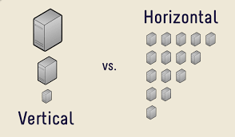
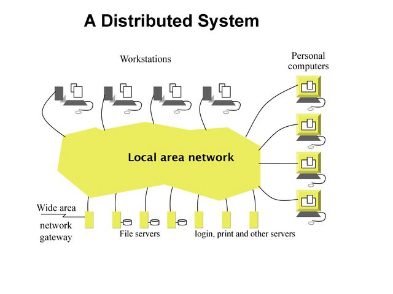
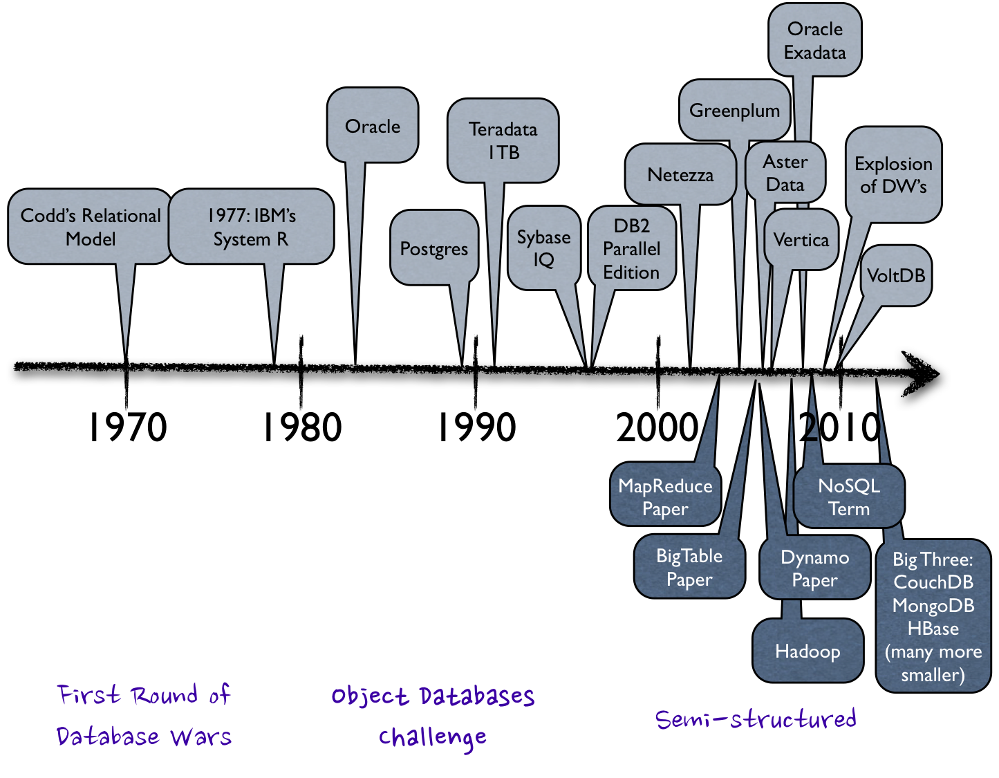
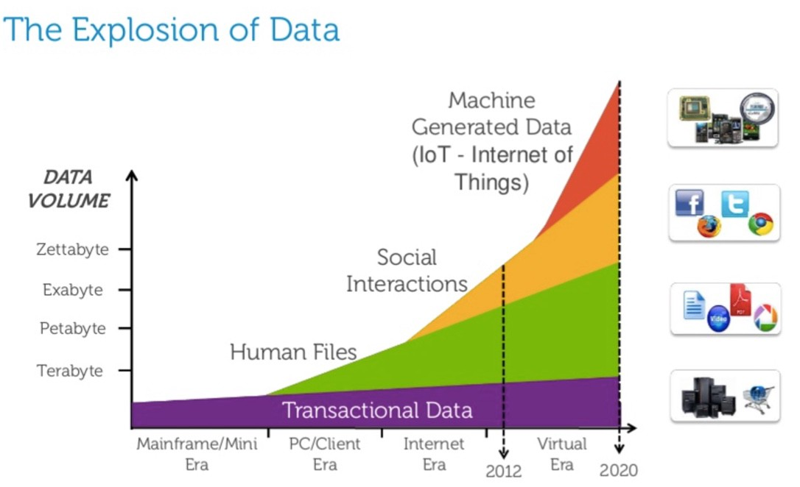
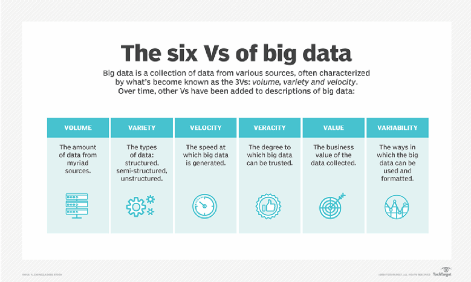

# Introduction to Big Data

Data, and the insight it offers, is essential for business to innovate and differentiate. Coming from a variety of sources, from inside the firewall out to the edge, the growth of data in terms of volume, variety and speed leads to innovative approaches. Today, Data Lakes allow organizations to accumulate huge reservoirs of information for future analysis. At the same time, the Cloud provides easy access to technologies to those who do not have the necessary infrastructure and Artificial Intelligence promises to proactively simplify management.

With Big Data technologies, Business Intelligence is entering a new era. Hadoop and the likes, NoSQL databases, and Cloud managed infrastructures store and represent structured and unstructured data and time series such as logs and sensors. From collect to visualization, the whole processing chain is processed in batch and real time.

## Basic knowledge

### Information Systems

What is an Information System (IS)?

- Collect data
- Process it
- Store it
- Distribute it

### Horizontal vs vertical scaling

- Vertical scaling: increase the size of the servers = more RAM, more powerful CPUs, more disk space, etc.
- Horizontal scaling: increase the number of server instead of ther size. Works for distributed systems.

### Distributed systems

A distributed system is a group of computers that appear as a unique and coherent system to the end user.

Advantages:

- Scalability
- Availability
- Flexibility

Disadvantages:

- Harder to architecture
- Harder to use
- Harder to maintain

### Data structure

- Structured: RDBMS tables, Excel
- Semi-structured: JSON, XML, CSV
- Unstructured: plain text, images, sound

## History of data

1965 - First mention of `Data center`

70's - 2000's: RDBMS

- Data created and used by companies (technical data, HR data)
- Structured

2000's-2005: (Fast) Internet rises, Hardware gets cheaper

- Access to data
- Unstructured data
- Beginning of NoSQL

2005-today: Social networks, customer 360

- Data explosion
- Data created and used by everyone
- End of Moore law

## Big Data: The 6 Vs

[Reference](https://searchdatamanagement.techtarget.com/definition/big-data)

## Why do we need Big Data?

- Understand
- Predict

Big Data use cases are often related to ML/AI.

## Big Data clusters

- Cluster: Group of connected computers that can be viewed as a single system
- Master-slave model
- Examples:
  - Apache Hadoop
  - Elasticsearch

## The Hadoop Ecosystem

- Distributed Filesystem: HDFS
- Cluster Manager: YARN
- Execution Engines: MapReduce, Tez, Spark
- Warehouse /SQL: Hive
- NoSQL DB: HBase
- And other stuff

## Data jobs

### Data Analyst

- Business intelligence
- Data Mining
- Visualisation, graphs
- SQL / BI Tools

### Data Scientist

- Machine Learning / Deep Learning
- Feature engineering - Visualisation
- Python / R

#### Data Science hierarchy of needs

- Learn, optimize
- Aggregate, label
- Explore, transform
- Move, store
- Collect

### Data Engineer

Data Engineers are in charge of building the infrastructure to deliver, store and process the data. He collects, moves, stores and prepares the data.

- Data ingestion and storage
- Data pipelines and orchestration - Optimization
- Hive / Spark / DFS

### Data Architect

- Data Lake architecture
- Components installation and monitoring
- Ensure the data is securely accessed and governed
- Knowledge of all available Big Data tools

### Data Something...

- Data Steward
- Chief Data Officer
- ML Engineer

## Resources

- [Data Engineering](https://www.adaltas.com/en/skills/data-engineering/)
- [Data Science](https://www.adaltas.com/en/skills/data-science/)
- [How to become a Data Engineer](https://khashtamov.com/en/how-to-become-a-data-engineer/) (jan 2020)
