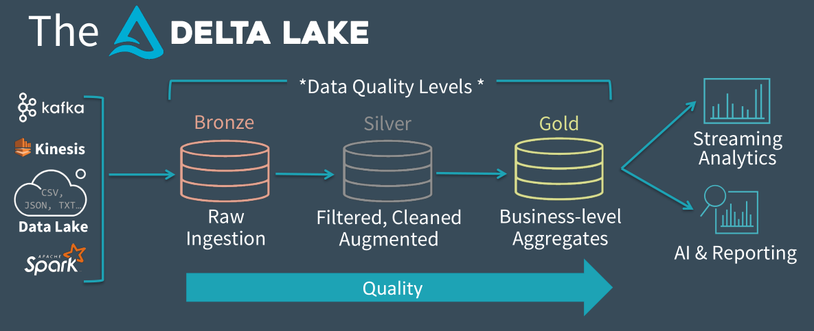

# Data warehousing with Hive

## OLAP vs OLTP

- **OLAP**: OnLine Analytical Processing
  - Process billions of rows in ETL (Extract Transform Load) batch pipelines
  - Join multiple tables
- **OLTP**: OnLine Transactional Processing
  - Read/insert/update a few values the fastest possible

## Apache Hive

- Query data on HDFS using **SQL like language**: HiveQL
- Converts **HiveQL to a DAG of jobs** on YARN
- Works with multiple execution frameworks:
  - MapReduce: disk I/O intensive
  - Tez: uses RAM and can chain reduces
  - (Spark)

## Query data on HDFS

- Enables to query data **already** on HDFS

- Supports **multiple file formats**:

  - Readable semi-structured (CSV, JSON…)

    ```json
    [
      { "key1": "value1", "key2": 2 },
      { "key1": "value2", "key2": 3 }
    ]
    ```

    ```
    key1,key2
    value1,2
    value2,3

    => key1,key2\n"value1",2\n"biggervalue2",3\n
    ```

  - Optimized file format (**ORC**, **Parquet**, Avro)

- Can also read data from other systems : HBase, Kafka, PostgreSQL/MySQL, etc.

## Data file formats

- **Columnar** file formats:
  - Split and compressed by column (binary formats)
  - Embedded statistics on data
  - Embedded schema
  - Examples: Apache ORC, Apache Parquet
- Exchange file formats: Apache Avro, Protocol Buffers, Apache Arrow


## What is a Hive table?

- 1 Hive table:

  - 1 name: e.g. `website.users`

  - 1 folder in HDFS with data files: e.g. `/data/hive/website.db/users`

    ```bash
    $ hdfs dfs -ls /data/hive/website.db/users
    /data/hive/website.db/users/221122-new-users.csv
    /data/hive/website.db/users/231122-new-users.csv
    /data/hive/website.db/users/...
    ```

  - 1 file format: e.g. `CSV`

  - 1 schema: e.g. `firstname STRING, lastname STRING, age INT, ...`

  - Statistics:

    - Number of files
    - Total size

## Hive components

- **HiveServer**
  - Translates HQL queries to Tez or MR jobs
- **Hive Metastore** (stores data in RDBMS)
  - Stores metadata (table names, schema, data location in HDFS)
  - Stores statistics on the tables
- **Hive clients** (JDBC). E.g. Beeline


## Example: daily ingestion of CSV file

- Everyday a new CSV file is added on HDFS
- An external Hive table is created to be able to query it
  - It points to the folder where the CSV data is
  - CSV can already be queries, but it’s not optimal
- We create another Hive table, stored as ORC instead
  - Stored in another HDFS folder
  - We ingest the CSV data from the first table to this one

## Hive partitions

- Tables can (**should**) be organized in partitions

  - Divide a table into related parts based on the values of particular columns (e.g. **date**, country, etc.)

  - Enables to query parts of the data (avoid full scan)

  - There should not be to many (small files problem)

  - 1 partition = 1 subfolder in HDFS

    ```
    sales_table
    ├── p_year=2020
    │   ├── p_month=1
    │   │   └── orc_data
    │   └── p_month=2
    │       └── orc_data
    └── p_year=2021
        └── p_month=1
            └── orc_data
    ```

    ```sql
    SELECT ... FROM ... WHERE p_year = 2020 AND p_month = 1;
    ```

## Bronze/silver/gold paradigm


