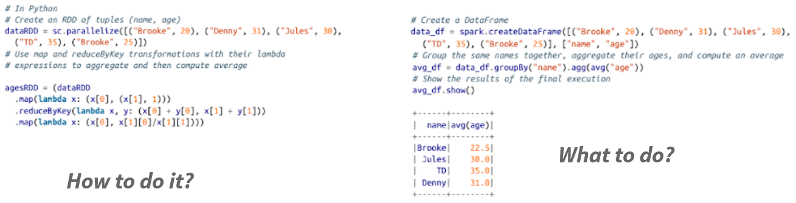
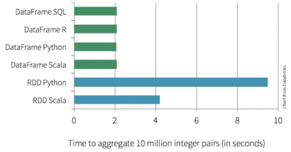
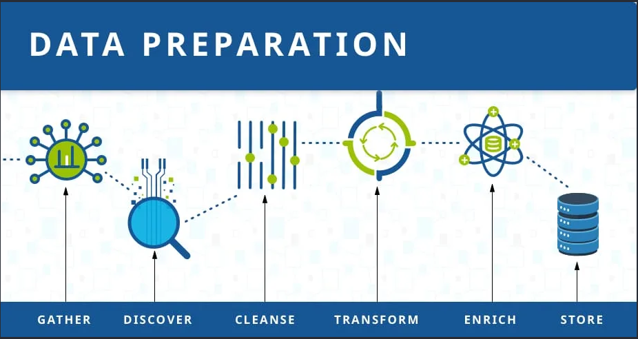
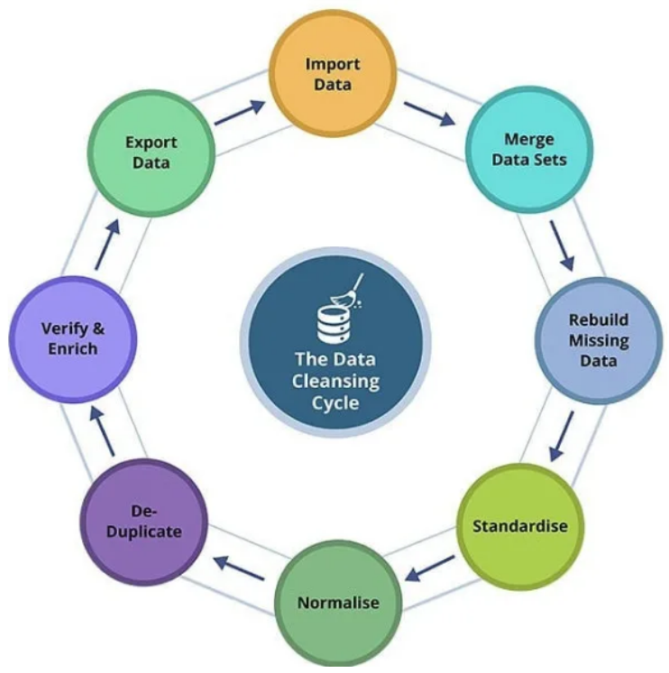
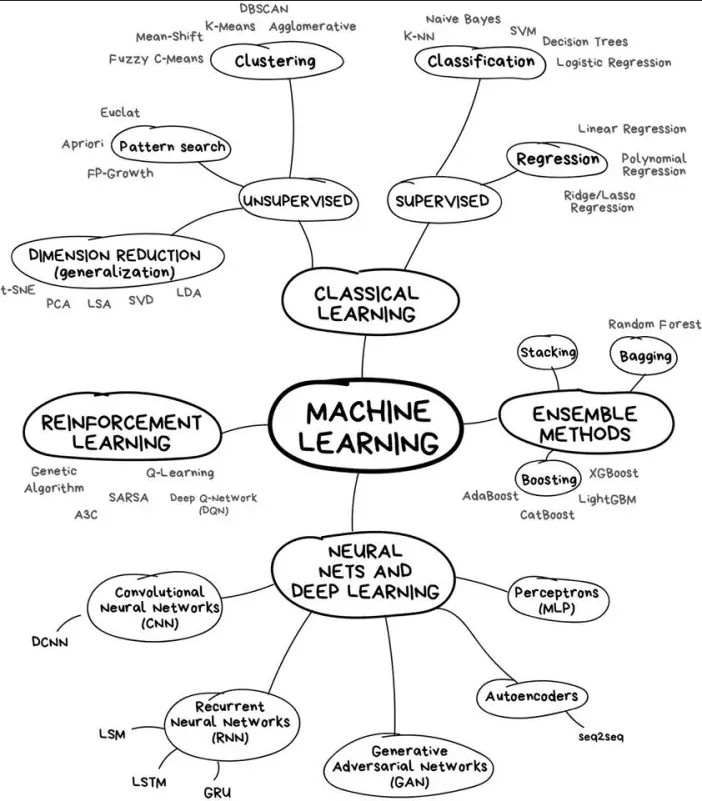
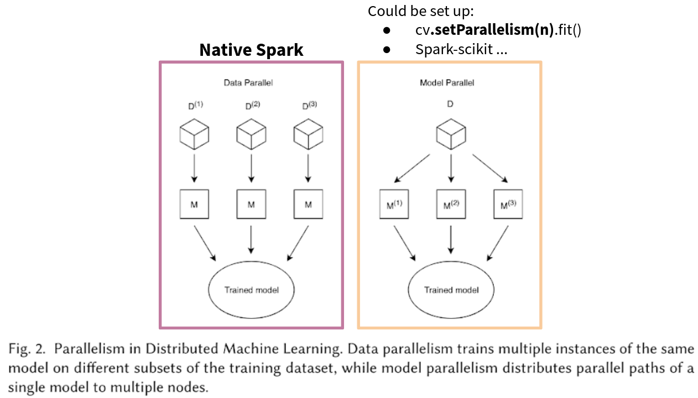
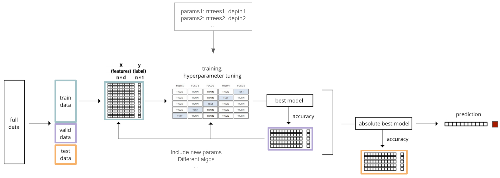
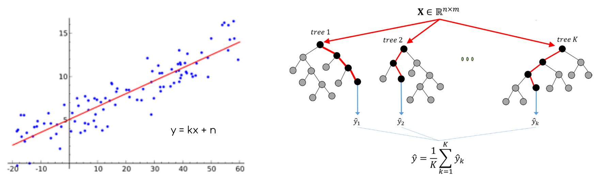

# Spark Advanced

# SparkSQL & DataFrames

## RDDs: Pros and Cons

- Pros
    - Developers: **low level control** of execution
- Cons
  - For user
      - **complicated** to express complex ideas
      - **difficult** to understand the code
  - For Spark: lambda functions are **opaque** (no optimization)

## DataFrames

- Structured dataset:
  - In-memory, distributed tables
  - Named and typed columns: schema
  - Collection of **Row**s
- Sources available: structured files, Hive tables, RDBMS (MySQL, PostgreSQL, …), RDDs
- High-level APIs

## RDDs vs DataFrames: code



## RDDs vs DataFrames: performance



### Catalyst optimizer


## Working with DataFrames

Querying DataFrames:
- By **chaining** functions

```python
df
  .select(...)
  .filter(...)
```

- By writing **SQL strings**

```python
spark.sql("SELECT * FROM table")
```

## Why SQL?

- Around since the 70s
- Huge enterprise usage:
  - Lots of users
  - Lots of projects
- But: cannot be used for ML or graph analyses


# Machine Learning with Spark MLlib

## Spark Ecosystem

**ADD IMAGE**

## Machine Learning With Spark: packages

- spark.mllib:
  - RDD-based (DF functionalities being added)
  - In maintenance since Spark 2.0 (now 3.x)
- spark.ml:
  - Newer
  - DataFrames-based

The term **MLlib** is used for both.

## Machine Learning

Data preparation:
- cleansing
- enrichment
- feature engineering





[Resource](https://www.talend.com/resources/what-is-data-preparation/)

Modeling:



[Resource](https://noeliagorod.com/2019/05/21/machine-learning-for-everyone-in-simple-words-with-real-world-examples-yes-again/)

## MLlib: Functionalities

ML algorithms include:

- Classification: logistic regression, naive Bayes,...
- Regression: generalized linear regression, survival regression,...
- Decision trees, random forests, and gradient-boosted trees
- Recommendation: alternating least squares (ALS)
- Clustering: K-means, Gaussian mixtures (GMMs)...
- Topic modeling: latent Dirichlet allocation (LDA)
- Frequent itemsets, association rules, and sequential pattern mining

ML workflow utilities include:

- Feature transformations: standardization, normalization, hashing...
- ML Pipeline construction
- Model evaluation and hyper-parameter tuning
- ML persistence: saving and loading models and Pipelines

Other utilities include:

- Distributed linear algebra: SVD, PCA...
- Statistics: summary statistics, hypothesis testing...

[Spark MLlib](https://spark.apache.org/mllib/)
[ML guide](https://spark.apache.org/docs/latest/ml-guide.html)

## When do we choose ML with Spark?

Pros:
- We can process big datasets
- One framework from data preparation to modeling

Cons:
- The algorithms need to be re-written for distributed computing
- No visualization natively present in Spark
- Different functionalities with different APIs (e.g. XGBoost only in Scala)
- Not necessarily faster

## Spark Data Structures and connection to Python


## Types of Parallelism



[Resource](https://arxiv.org/pdf/1912.09789.pdf)

## ML Terminology (Spark, sklearn…)

Transformer:
- Input: DF → output: DF via **.transform()**
- Apply rule-based transformation, **no learning**
- Example: One-hot encoding, model

Estimator:
- **Learns** parameters via **.fit()** method
- Returns a model

Pipeline:
- Putting a series of transformers and estimators in a sequence
- **Automation**

## Steps of a Machine Learning project

- Dataset preparation (cleaning, feature engineering)
- Train/test (train/validation/test) split: 80/20 (60/20/20)
- Train the model (on the **train** data)
  - Cross-validation, leave-one-out
- Estimate the quality of the model (on the **validation** data)
- Tune the model to improve the performance
  - Grid search
- Test the final performance on the **test** data



## Linear Regression and Random Forest regression




# App Packaging and Submitting

## Spark functionalities recap

- Batch processing with:
  - Resilient Distributed Datasets
  - DataFrames
- Structured Streaming processing

And also:

- Spark MLlib:
  - Distributed model training
  - Apply models to data
- GraphX: distributed graph processing

## Spark application components

- Java and Scala: "Uber" **jar** file
  - Spark code
  - Dependencies (libraries)
- Python: .py, .zip or .egg files

## Spark application configuration

- Deploy mode: client or cluster
- Driver and executors:
  - Memory
  - Cores
  - Number of executors

## Spark application monitoring

- One web UI per application
- Track:
  - Jobs
  - Stages
  - Executors

## Spark application performance tuning

- Limit number of shuffles
- 3 partitions / CPU
- Start big, then reduce memory
- Lot of testing, monitoring, benchmarking (optimize properties one by one)

