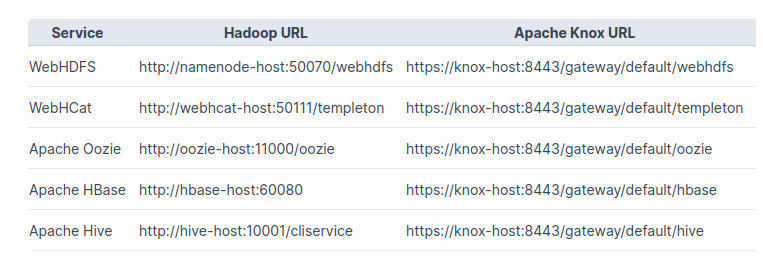

# Architecture and security

## Hadoop cluster topology

Hadoop high-level architecture


Location of components and subcomponents:

- **Masters**: NN, RM, HBaseMaster
Supposed to host master services of the components which have the master/slave architecture:
    - low level of computation
    - low amount of storage
    - high level of security/criticity

- **Utility**: HiveMetastore, HiveServer2, Oozie*, Ambari**:
    - hosts services that enrich the functionalities of the cluster, these services usually act like a client to Hadoop(HDFS/Yarn), however they still have a master role for end-users.

- **Workers**: DN, NM, RS:
    - for computation
    - for storage
    - high level of security

- **Edge nodes**: HiveServer2, Zeppelin, clients (hdfs, yarn, beeline, hbase, spark):
  - Interface between the end-user and the cluster
  - storage for potential user environment

* Oozie: Apache Oozie is a server-based workflow scheduling system to manage Hadoop jobs

** Ambari: Apache Ambari is an open-source administration tool deployed on top of Hadoop clusters


Node hardware specifications:

- **Masters**: medium RAM/CPU
- **Utility**: medium RAM/CPU
- **Workers**: lot of RAM/CPU, lots of disks (> 10)
- **Edge nodes**: can be VMs/containers

## Security

3 main principles:

- **Identification**: identification is the ability to identify uniquely a user of a system or an application that is running in the system
- **Authentication**: authentication is the ability to prove that a user or application is genuinely who that person or what that application claims to be
- **Authorization**: check user’s access rights to resources
- **+ Privacy** = Encryption


## Security: locally

Unix permissions (in Linux, MacOS):

- **UID + GID** (User ID, Group ID, e.g. can find out which user your are with the `whoami` command
- User rights on unix system:
  - /etc/passwd
  - you can set user and group permissions with the `chmod` command e.g. `chmod 754 file`
- Identification only
- Impersonnation through su or sudo command:
  - su command allows you to chyange user
  - sudo command executes the command as super-user

## Identification: LDAP

LDAP = Lightweight Directory Access Protocol
The Lightweight Directory Access Protocol is an open, vendor-neutral, industry standard application protocol for accessing and maintaining distributed directory information services over an Internet Protocol (TCP/IP) network.

- Stores **users** and **groups**:
    - Respects a strict hierachical directory structure
    - Each user and group is an object with a unique identifier
    - Each object can have several attributes
- Allows **identification** (“this user exists and belongs to those groups”)
- Also stores passwords for basic authentication
- Examples: OpenLDAP, FreeIPA, Active Directory


```bash
ldapsearch --hostname localhost --port 1389 --baseDN "dc=example,dc=com" \
  "(objectclass=*)"
dn: dc=example,dc=com
objectClass: domain
objectClass: top
dc: example

dn: ou=Groups,dc=example,dc=com
objectClass: organizationalunit
objectClass: top
ou: Groups

dn: cn=Directory Administrators,ou=Groups,dc=example,dc=com
objectClass: groupofuniquenames
objectClass: top
ou: Groups
cn: Directory Administrators
uniquemember: uid=kvaughan, ou=People, dc=example,dc=com
uniquemember: uid=rdaugherty, ou=People, dc=example,dc=com
uniquemember: uid=hmiller, ou=People, dc=example,dc=com
```


## Authentication: Kerberos

- Authentication based on a **ticketing system**
- Single Sign-On (SSO)
- Mutual authentication (client-service)
- **Control access to services** by authenticating the users

- **Realm**: Administrative domain handled by a Kerberos server.
  - E.g. `AU.ADALTAS.CLOUD`
- **Principal**: Kerberos name associated to a user/service
  - E.g. `gauthier@AU.ADALTAS.CLOUD`, `hive/hs1.adaltas.cloud@AU.ADALTAS.CLOUD`
- **Ticket**: Token proving the user’s identity or the user’s right to
access a service


For more information, read [here](https://en.wikipedia.org/wiki/Kerberos_(protocol)#Protocol).

## Authorization: Apache Ranger

RBAC (Role Based Access Control) on Hadoop:

- HDFS (*rwx* on folders)
- YARN (access to queues)
- Hive (access to tables, columns)
- HBase (access to tables, column families, columns)

Integration with LDAP

Apache Ranger is a framework for centralized security and access management across various components of a Hadoop ecosystem.

  - Policy Definition is the policy defined by administrators stating which user has access to a specific resource or application.

  - Policy Repository is the central repository mostly backed by a database where Ranger stores the policy definitions.

  - Policy Enforcement where Ranger plugins deployed alongside each Hadoop ecosystem component intercept requests made to the respective components and enforce the policies defined in the repository.

  - Authorization Decision to allow or deny access to a user.

  - Auditing and Logging where all access attempts and policy decisions are captured in the audit logs.

  - Fine-Grained Access Control allowing administrators to define authorizations based on various factors, such as user identity, group membership, IP address, time of day, and more.

  - Integration with External Systems such as Kerberos or Apache Knox

  - Dynamic Policy Updates which allows administrators to modify policies without requiring a restart of the Ranger service or the Hadoop ecosystem components.

## Privacy: Encryption in Hadoop

- Possible usage of SSL (like HTTPS) for services and client-service communications
- Wire encryption
- Encryption at rest
- Performance impact

## Centralized gateway: Apache Knox

APache Knox is a reverse proxy which acts as single entry-point for users to the Hadoop cluster.

- Avoid using Kerberos to connect to web UIs and services (SPNEGO*)
- Expose all services on a single endpoint: each Apache Hadoop cluster that is protected by Knox has its set of REST APIs represented by a single cluster specific application context path
- Apache Knox includes an Apache Ranger agent to check the permissions of users who want to access cluster ressources.

* SPNEGO: Simple and Protected GSSAPI Negotiation Mechanism is a protocol used for single sign-on (SSO) authentication in web applications. It is based on the Generic Security Services Application Programming Interface (GSSAPI) framework, which provides a standardized way for applications to authenticate and secure communications.



## Governance

- Data catalog
- Audit logs (who accessed what data)
- Data lineage (application: GDPR)
- **Apache Atlas**:
Apache Atlas is an open-source metadata management and governance framework that is designed to provide a unified view of data assets within an organization.
  - Allows adding tags to data, tag propagation (example taging a table)
  - Integration with Ranger to apply permissions
